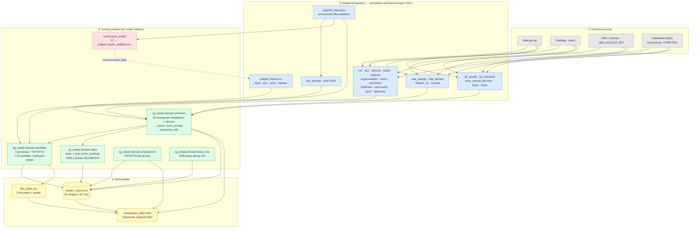

# SG-Estate-Framework — Data Flow, Criteria & Conditions

A map of how the Singapore housing-estate scoring pipeline turns raw open data into the
headline `data/outputs/master_output.csv`. Two load-bearing conceptual pillars — **Provision**
(supply-side, objective, comparable) and **Liveability/Value** (demand-side, person-relative,
non-comparable by design). The split is structural: a single number cannot be both
objectively-comparable AND person-relevant.

> Authoritative numbers live in `sg_estate/domain/framework.py` (weights, deltas, bands) and
> `sg_estate/domain/aliases.py` (alias maps). The `frameworks/*.md` documents are the **spec**, not stale
> docs. This file is a navigational overview; on any conflict, the spec + config win.

---

## 1. Data flow



**Red dashed** = `momentum_model` is intentionally **not** auto-wired into `make pipeline`. It writes
`judged_inputs_updated.csv` for human review; values must be vetted and copied into `judged_inputs.csv`
(which also carries manual `mom` overrides a blind copy would clobber) before re-running provision.

**Run order** (`make pipeline`): ingesters → `sg_estate.domain.provision` →
`sg_estate.domain.liveability` → `sg_estate.domain.value` (×2: HDB-only,
then HDB+private) → `sg_estate.domain.lease_risk` →
`sg_estate.domain.employment` → `sg_estate.application.master`.

---

## 2. Criteria

### Provision — 20 components (weights sum to 1.0)

| # | Component | w | w_private | Provenance |
|---|---|--:|--:|---|
| 1 | conn (connectivity) | 0.14 | 0.11 | MEASURED |
| 2 | infra (operational trunk infra) | 0.14 | 0.13 | MEASURED |
| 3 | amen (daily amenities) | 0.09 | 0.12 | MEASURED |
| 4 | green (usable greenery) | 0.08 | 0.07 | MEASURED |
| 5 | dens (dwelling density) | 0.08 | 0.08 | PARTLY_MEASURED |
| 6 | sch (school access) | 0.07 | 0.11 | MEASURED |
| 7 | childcare | 0.05 | 0.05 | MEASURED |
| 8 | hlth (primary care) | 0.04 | 0.04 | MEASURED |
| 9 | mom (momentum / confirmed additions) | 0.04 | 0.04 | PARTLY_MEASURED |
| 10 | hawker | 0.04 | 0.02 | PARTLY_MEASURED |
| 11 | noise (expressway) | 0.03 | 0.04 | MEASURED |
| 12 | air_noise (flight corridors) | 0.03 | 0.03 | MEASURED |
| 13 | eldercare | 0.03 | 0.02 | MEASURED |
| 14 | stewardship (TCMR upkeep) | 0.03 | 0.02 | PARTLY_MEASURED |
| 15 | air_quality | 0.03 | 0.03 | PARTLY_MEASURED |
| 16 | community | 0.02 | 0.03 | MEASURED |
| 17 | sport | 0.02 | 0.01 | MEASURED |
| 18 | jtc_industrial (proximity penalty) | 0.02 | 0.02 | MEASURED |
| 19 | env (heat/shade) | 0.01 | 0.02 | PARTLY_MEASURED |
| 20 | flood | 0.01 | 0.01 | MEASURED |

**Provenance split: 14 MEASURED + 6 PARTLY_MEASURED (dens, env, mom, air_quality, stewardship, hawker) + 0 JUDGED.**
`measured_only=True` whenever any of the 6 PARTLY inputs is missing.

**Bands:** A ≥ 4.5 · B+ ≥ 4.0 · B ≥ 3.5 · C ≥ 3.0 · D ≥ 2.5 · F < 2.5.

### Liveability — 4 personas × 3 horizons (T0 / T5 / T15)

```
Cell(estate, persona, horizon) = Σ[ w_persona(i) × S_i(horizon) ] × D(estate) × C_persona(estate)
```
- `w_persona` = Provision weights + signed persona Δ on 9 S-groups, renormalised.
- `S_i(T5/T15)` folds in confirmed pipeline additions, discounted by **Certainty × Time × SlipPremium (rail 0.85)**.
- `C_persona` = persona vetoes (Schools=1 caps young-family at C; Healthcare=1 caps retiree at C).
- `D(estate)` = construction-disruption multiplier (losses only; floor 0.70).

**Persona Δ (percentage points on 9 S-groups):**

| S-group | Young family | Single pro | Retiree | Lifestyle |
|---|--:|--:|--:|--:|
| S1 connectivity | −7 | +8 | −3 | +6 |
| S2 amenities | +1 | +2 | +4 | +3 |
| S3 green/blue | +4 | −2 | +4 | −2 |
| S4 schools | +7 | −9 | −9 | −10 |
| S5 density | 0 | −3 | +2 | +4 |
| S6 healthcare | +1 | −4 | +12 | −6 |
| S7 momentum | −5 | +3 | −5 | +2 |
| S8 infra readiness | −2 | +1 | −2 | +1 |
| S9 env comfort | +2 | +4 | −3 | +2 |

(Columns sum to 0 except Young family = +1, left visible by design per the v0.x calibration log.)

### Value — lives inside Liveability

```
Value(a, segment) = base(a, segment) × exp(−ValueResidual(a, segment))
```
- `base` is **segment-aware**: HDB → public Provision score; private → `score_private` (W_PRIVATE condo weights).
- `ValueResidual` = within-segment regression residual of ln(price_psm), hierarchical-shrinkage smoothed.
- **HDB and private are separate universes** — never blended or ranked across.

### Life-paths (the answer for a real human — `frameworks/2 §4`)

| Life-path | Reads cells (T0 → T5) |
|---|---|
| Forming family | single-pro → young-family |
| Settling single | lifestyle → single-pro |
| Ageing in place | retiree → retiree |
| Downsizing | young-family → retiree |
| Upgrader | single-pro → lifestyle |

---

## 3. Conditions (rules the code actively enforces)

| Gate / rule | Where | Behaviour |
|---|---|---|
| **Provenance honesty** | `sg_estate.domain.provision` | Missing PARTLY input → renormalise over present components, set `measured_only=True`. NEVER impute. |
| **X-archetype N/R gate** | `sg_estate.domain.liveability`, `sg_estate.application.master` | Non-residential strategic districts (e.g. CENTRAL AREA) → all scored cells `N/R`. |
| **D = losses only** | `sg_estate.domain.liveability` | Construction disruptions + BCA severity subtract from D; positive additions go to S7/T5, never D. Hard floor 0.70. |
| **Rail slip premium** | `sg_estate.domain.liveability` | MRT future additions × 0.85 (rail projects slip). PLANNED excluded at T5, included at 40% for T15. |
| **Value trust floor** | `sg_estate.domain.value` | Below `trust_decimal_n=100` transactions → report a **band only**, no decimal. Multiplier clipped to [0.75, 1.25]. |
| **Separate universes** | `sg_estate.domain.value` | HDB resale, private resale, private rental are distinct segments with different controls. |
| **Single-sourcing** | `sg_estate.domain.framework`, `sg_estate.domain.aliases` | Weights/deltas/bands and alias maps have one canonical owner. No local copies. |
| **Fail loud** | all loaders | A supplied-but-missing input path exits with an error, never silently skips. |
| **Determinism** | ingesters | `bca_permits --year 2026` (not `date.today()`); committed CSVs reproduce run-to-run (guarded by `tests/test_reproducibility.py`). |

---

Regenerate the rendered HTML deliverables after a pipeline run with
`python3 -m sg_estate.reporting.builders.comparison` and
`python3 -m sg_estate.reporting.builders.framework_diagram`.
